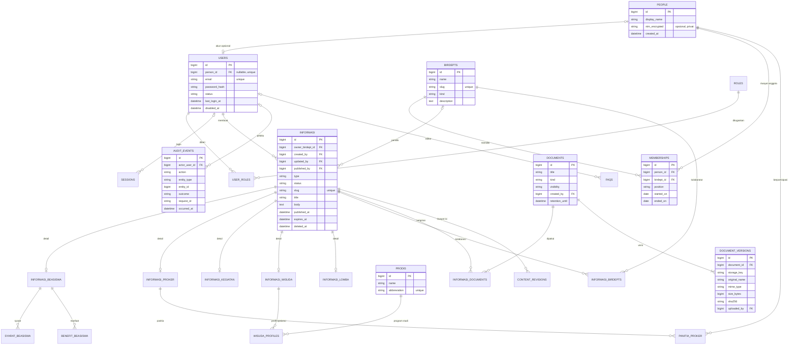

# Rencana ERD M-SPACE v2

Status: **fase aditif ERD v2 sudah dimigrasikan pada database lokal `mspace` pada 26 September 2026**. Kolom dan tabel lama tetap dipertahankan sementara kedua aplikasi beralih ke struktur baru. Rincian implementasi dan batasnya ada di [erd-v2-implementation.md](erd-v2-implementation.md). **Gambar ERD pengguna menjadi patokan struktur utama**; migrasi aplikasi publik dan dashboard `D:\herd\admin-mspace` dipakai untuk memeriksa data/fitur yang perlu dipertahankan atau diperbaiki.

## Keputusan desain

1. `users` berarti **akun yang dapat masuk dashboard**. Pengunjung situs publik yang hanya membaca halaman tidak dibuatkan baris `users` atau `sessions.user_id` khusus. `users_umum` tidak diperlukan saat ini. Jika kelak ada layanan dengan login mahasiswa, perluas `users` dengan peran `public_member`, bukan membuat akun untuk setiap pengunjung.
2. Orang/anggota BEM dipisahkan dari akun login: `people` menyimpan identitas minimum; `memberships` menyimpan riwayat keanggotaan unit dan jabatan. `users.person_id` boleh kosong dan unik. Panitia proker mengacu ke `people`/`memberships`, sehingga seseorang tidak perlu menjadi admin hanya untuk tercatat sebagai panitia.
3. `informasi` adalah induk konten. Setiap baris punya tepat satu jenis dan maksimal satu baris detail sesuai jenisnya. Jenis yang belum punya data khusus cukup di induk; jangan membuat tabel kosong. `informasi_proker`, `informasi_beasiswa`, dan tabel jenis lain memakai **PK sekaligus FK `informasi_id`**, bukan `id` baru di samping `idInformasi`.
4. Satu unit menjadi pemilik konten lewat `informasi.owner_birdept_id`. Relasi kerja sama lintas unit ada di `informasi_birdepts` hanya bila memang dibutuhkan; jangan menggandakan peran pemilik di pivot.
5. Berkas ditempatkan di `documents` + `document_versions`, lalu dihubungkan ke konten melalui `informasi_documents`. Tabel ini menampung poster, PDF kalender/pedoman, foto kegiatan, dan lampiran. Simpan kunci lokasi penyimpanan, bukan biner di database.
6. `sessions` tetap tabel teknis Laravel. Jejak tindakan admin ada di `audit_events`; perubahan isi konten ada di `content_revisions`. Keduanya berbeda dari analitik pengunjung.

## Pilihan tipe data berdasarkan gambar

| Kolom pada gambar | Rekomendasi | Alasan |
| --- | --- | --- |
| `birdept.nama`, `birdept.singkatan` | `VARCHAR`, dengan `singkatan`/`slug` unik | Nama unit adalah data yang dapat berganti; **jangan** jadikan daftar nama unit sebagai `ENUM`. Relasi dari tabel lain memakai `birdept_id` FK. |
| `birdept.jenis` | `ENUM('bph','biro','departemen')` bila tiga kategori ini disepakati tetap; jika organisasi sering berubah, `VARCHAR(20)` + pembatasan nilai/lookup | Kategori pendek dan terbatas; pilihan skema harus mengikuti kemungkinan perubahan nyata. |
| `prodi.nama`, `prodi.singkatan` | Tabel `prodis` berisi `VARCHAR`; tabel lain memakai `prodi_id` FK | Prodi pada gambar sudah merupakan entitas referensi. Nama prodi dapat berubah tanpa mengubah definisi tabel `users` atau `wisuda`. |
| `faq.aktif` | `BOOLEAN NOT NULL DEFAULT TRUE` | Hanya dua keadaan. `prioritas`/`urutan` memakai integer, bukan enum. |
| `informasi.status` | `VARCHAR(20)` + validasi aplikasi dan constraint DB untuk `draft`, `review`, `published`, `archived` | Alur persetujuan dapat berkembang; jangan biarkan string bebas tanpa pembatasan. Jika alurnya dipastikan tidak berubah, DB enum juga sah. |
| `informasi.jenis` | `VARCHAR(30)` + constraint/lookup kode jenis | Gambar sudah memuat lomba, sementara migrasi belum; penambahan kategori seharusnya tidak memaksa perubahan enum di beberapa aplikasi. Kode jenis tetap harus cocok dengan satu tabel detail. |
| `users.jabatan` | `VARCHAR` atau tabel referensi jabatan organisasi | Jabatan BEM berbeda dari hak akses dashboard. Letakkan pada keanggotaan, bukan akun. |
| URL, judul, sumber, penyelenggara | `VARCHAR` dengan panjang dan validasi sesuai kebutuhan | Ini teks, bukan pilihan tertutup. |
| `rilis`, `kadaluarsa`, `loginAkhir` | `DATETIME`/`TIMESTAMP` nullable sesuai fungsi | Ini waktu kejadian. `created_at` dan `updated_at` tetap terpisah. |

Aturan praktis: **dua nilai** → boolean; **kode pilihan yang benar-benar tetap** → enum; **pilihan yang dikelola dan berubah sebagai data** → tabel referensi + FK; **teks bebas** → string/text. `VARCHAR` untuk kode pilihan tetap perlu validasi dan pembatasan pada database, karena string polos menerima salah ketik dan nilai tidak sah.

### Apakah setiap pengunjung mendapat session?

Dengan konfigurasi proyek saat ini (`SESSION_DRIVER=database`, masa aktif 120 menit), permintaan ke rute Laravel dalam grup `web` memulai session dan dapat menyimpan baris di `sessions` bahkan untuk pembaca anonim. `user_id` tetap `NULL` sampai orang login; satu browser dapat memakai session yang sama untuk beberapa halaman. Ini **bukan** satu baris per orang atau satu baris per page view. Browser berbeda dapat menghasilkan session berbeda; aset statis yang dilayani langsung oleh web server tidak melewati session Laravel. Session kedaluwarsa menurut `last_activity` + masa aktif dan dibersihkan terpisah.

Pada rancangan, `sessions` dipakai untuk autentikasi/CSRF/fitur sementara, bukan identitas pengunjung atau rekam perilaku. Jika situs publik tetap hanya-baca dan tidak memerlukan session, alur HTTP bisa dirancang stateless secara terpisah; ini perubahan middleware/CSRF, bukan sekadar menghapus tabel. Dashboard admin tetap memerlukan session login yang aman.

## ERD inti

Tabel detail tambahan yang memang dipakai: `informasi_magang`, `informasi_alumni`, `informasi_himpunan`. `prodis` dipertahankan sebagai tabel referensi sesuai gambar; jangan taruh `prodi` sebagai enum pada akun admin bila tidak diperlukan untuk autentikasi. `informasi_lomba` dipertahankan dalam rancangan karena ada pada gambar, walau migrasi saat ini belum membuatnya. `WISUDA_PROFILES` memisahkan nama, IPK, angkatan, dan prodi orang dari pengumuman wisuda umum; buat/sajikan profil ini hanya bila ada tujuan dan dasar pemrosesan yang jelas. Diagram gambar menduplikasi `SyaratBeasiswa` dan `BenefitBeasiswa`; masing-masing cukup satu tabel.

Kolom minimum untuk tabel yang tidak dirinci di kotak diagram:

| Tabel | Kolom inti dan kunci |
| --- | --- |
| `roles`, `user_roles` | `roles(id, code UNIQUE, name)`; `user_roles(user_id FK, role_id FK, PRIMARY KEY(user_id, role_id))`. Untuk peran editor per unit, gunakan pivot `user_birdept_roles` terpisah. |
| `informasi_beasiswa` | `informasi_id PK/FK`, penyelenggara, tanggal buka/tutup, URL pendaftaran. Poster melalui `informasi_documents.role='poster'`. |
| `informasi_proker` | `informasi_id PK/FK`, tujuan, sasaran, tanggal mulai/selesai. |
| `informasi_birdepts` | `informasi_id FK`, `birdept_id FK`, `PRIMARY KEY(informasi_id, birdept_id)`; hanya kolaborator, bukan pemilik. |
| `panitia_proker` | `informasi_id FK`, `person_id FK`, jabatan, divisi; kunci unik pasangan jika satu orang hanya boleh satu peran per proker. |
| `syarat_beasiswa`, `benefit_beasiswa` | `id PK`, `informasi_id FK` ke detail beasiswa, label, keterangan, `sort_order`. |
| `informasi_documents` | `informasi_id FK`, `document_id FK`, `role`, `sort_order`; kunci unik gabungan sesuai kebutuhan. |
| `content_revisions` | `id PK`, `informasi_id FK`, `version`, `changed_by FK`, `change_reason`, `safe_snapshot JSON`, `created_at`, `UNIQUE(informasi_id, version)`. |
| `faqs` | `id PK`, pertanyaan, jawaban, `birdept_id FK NULL`, `is_active`, `sort_order`, `created_by FK`, `updated_by FK`, timestamps. |

Untuk `created_by`, `updated_by`, dan `published_by`, keputusan hapus akun perlu eksplisit: umumnya akun dinonaktifkan lebih dulu; bila identitas harus dihapus, FK dibuat nullable dengan `SET NULL` dan audit direduksi sesuai retensi. Jangan gunakan `CASCADE` dari akun atau birdept ke konten publik karena penghapusan orang/unit dapat menghilangkan banyak arsip.

## Kolom dan aturan penting

| Area | Aturan |
| --- | --- |
| Akun | `users.email` unik, password hanya hash, `status` aktif/nonaktif, verifikasi email dan 2FA untuk peran sensitif. `jabatan` organisasi tidak otomatis memberi hak admin. |
| Hak akses | `roles` dan `user_roles` untuk peran global seperti super admin, editor, reviewer. Untuk hak per unit, tambahkan `user_birdept_roles(user_id, birdept_id, role_id)` dengan kunci unik gabungan. Semua rute dashboard perlu pemeriksaan izin server per aksi dan per unit. |
| Keanggotaan | `memberships` punya `CHECK(ended_on IS NULL OR ended_on >= started_on)`; jangan hapus orang saat masa jabatan berakhir. NIM/kontak hanya disimpan jika diperlukan, dibatasi akses dan masa simpannya. |
| Konten | `type` dan `status` terkontrol; indeks `(status, published_at)`, `(owner_birdept_id, status)`, `(type, expires_at)`; `published_at` terisi hanya untuk publikasi. Perubahan jenis konten harus menjaga detail sesuai jenis. |
| Tabel detail | `informasi_id` PK+FK unik, `ON DELETE CASCADE` pada detail saja. Periksa `tanggal_tutup >= tanggal_buka` dan `waktu_selesai >= waktu_mulai`. Syarat/manfaat memiliki `sort_order`. |
| FAQ | `is_active`, `sort_order`, `created_by`, `updated_by`, timestamp. `birdept_id` nullable hanya bila FAQ memang dimiliki unit; FAQ umum dibiarkan tanpa unit. |
| Dokumen | `storage_key` acak, MIME/ukuran/hash, versi, nama asli hanya metadata. `visibility` publik/privat dan pemeriksaan izin sebelum unduh. `informasi_documents` unik per `(informasi_id, document_id, role)`; `role` misalnya poster, lampiran, galeri. |
| Audit | Catat login berhasil/gagal, perubahan peran, ekspor data, buat/ubah/publikasi/hapus konten, akses dokumen privat, dan penanganan permintaan privasi. Audit append-only; simpan identitas pelaku, waktu, aksi, target, hasil, request ID, dan ringkasan perubahan yang aman. |
| Privasi | Jangan log password, token, isi sesi, NIM, telepon, atau isi formulir penuh. Retensi ditetapkan per kategori data; dukung penghapusan/anomisasi dan pemeriksaan cadangan. Catat dasar/pemberitahuan pemrosesan bila kelak ada formulir data pribadi. |

`audit_events.entity_type` + `entity_id` bersifat referensi logis untuk banyak jenis objek, bukan FK database. Jika integritas FK audit menjadi syarat, gunakan tabel audit khusus per domain atau `content_revisions` untuk konten. Riwayat revisi hanya menyimpan kolom konten yang perlu dibandingkan, bukan salinan kredensial atau data pribadi.

## Penanganan pengunjung yang bukan user

- Pembaca anonim: langsung akses konten `published` yang belum kedaluwarsa. Tidak perlu akun, `users_umum`, atau log perilaku individual.
- Pengirim formulir di masa depan: tabel `submissions` khusus keperluan formulir dengan `purpose`, `notice_version`, data minimum, `submitted_at`, `retention_until`, dan status penanganan. Buat akun hanya jika pengguna membutuhkan riwayat, pengaturan, atau akses ulang.
- Analitik kunjungan: mulai dari agregat harian per halaman (`page_view_daily`), tanpa NIM, alamat IP penuh, atau identitas lintas kunjungan. Hitungan `jumlah_kunjungan` sekarang bisa diganti/diturunkan dari agregat jika benar-benar dipakai.
- Permintaan akses/perbaikan/penghapusan data: bila ada data pribadi pengunjung, sediakan `privacy_requests` dengan identitas pemohon terbatas, jenis permintaan, status, tenggat internal, dan pelaksana. Pisahkan bukti verifikasi dari konten publik.

## Perbedaan gambar, kode, dan target

| Gambar / keadaan sekarang | Rencana |
| --- | --- |
| `users.idBirdept` pada gambar; kode memakai `users_bem`; anggota tanpa akun tidak terwakili | `people` + `memberships`; `users` hanya akun dashboard |
| Gambar menambah PK `Id` dan FK `IdInformasi` pada setiap detail; kode saat ini menggunakan PK `id` sekaligus FK | Pertahankan pola PK=FK yang sudah benar, ganti nama secara konsisten bila migrasi baru dibuat |
| `birdeptProker` pada gambar; kode kini hanya `informasi.idbirdept` dan `panitia_proker` | Unit pemilik di `informasi`, pivot kolaborator hanya jika proker lintas unit |
| `InformasiDokumentasi` berulang dan hanya `namaFile`; berkas PDF/gambar juga disimpan di `public/` | `documents`, `document_versions`, `informasi_documents`, kontrol akses dan metadata berkas |
| `sessions` pada gambar memuat waktu dibuat/habis; migrasi Laravel hanya `id`, `user_id`, `ip_address`, `user_agent`, `payload`, `last_activity` | Ikuti skema teknis Laravel; audit dan masa retensi dikelola terpisah |
| Migrasi aplikasi publik dan dashboard admin sama-sama mendefinisikan tabel inti, dan dashboard admin memiliki migrasi lama yang juga menciptakan tabel duplikat | Tetapkan satu pemilik migrasi/skema bersama; aplikasi lain hanya memakai skema tersebut |

## Urutan pelaksanaan

1. **Amankan dashboard dulu.** Gate dan policy telah ditambahkan dalam kode dashboard, termasuk pembatasan impor/ekspor dan penonaktifan pendaftaran publik. Kolom `admin_role` milik migrasi dashboard masih harus diterapkan bersama penetapan akun admin pertama yang berwenang.
2. Bekukan kamus data: nama tabel/kolom, tipe, arti, pemilik, klasifikasi publik/privat, alasan pengumpulan, masa simpan, dan aturan penghapusan. Tentukan satu repositori/mekanisme yang menjadi sumber migrasi untuk kedua aplikasi.
3. Tambahkan tabel baru secara bertahap (`people`, `memberships`, peran, dokumen, revisi, audit) tanpa menghapus tabel lama. Petakan dan salin data dengan skrip migrasi yang dapat diuji dan diulang.
4. Perbarui model, otorisasi, impor/ekspor, controller, dan pembacaan situs publik; uji kasus hak akses lintas peran/unit dan integritas FK. Setelah hasil cocok, hentikan penulisan ke kolom lama lalu hapus dalam migrasi terpisah.
5. Dokumentasikan ERD final, kamus data, matriks izin, alur publikasi, daftar kategori data pribadi, jadwal retensi, prosedur pemulihan cadangan, dan riwayat perubahan skema. Tinjau periodik.

Rancangan privasi ini perlu dicocokkan dengan tujuan pemrosesan yang nyata dan ketentuan UU Pelindungan Data Pribadi sebelum dipakai sebagai kebijakan operasional.

## Rujukan desain

- [Laravel 11: foreign key dan tindakan saat penghapusan](https://laravel.com/framework/docs/11.x/migrations)
- [Laravel 11: gate dan policy untuk otorisasi](https://laravel.com/framework/docs/11.x/authorization)
- [OWASP: otorisasi dengan hak minimum dan penolakan sebagai nilai awal](https://cheatsheetseries.owasp.org/cheatsheets/Authorization_Cheat_Sheet.html)
- [OWASP: pencatatan keamanan dan data yang harus disamarkan/dikecualikan](https://cheatsheetseries.owasp.org/cheatsheets/Logging_Cheat_Sheet.html)
- [UU Nomor 27 Tahun 2022 tentang Pelindungan Data Pribadi](https://peraturan.go.id/files/Salinan%2BUU%2BNomor%2B27%2BTahun%2B2022.pdf)
